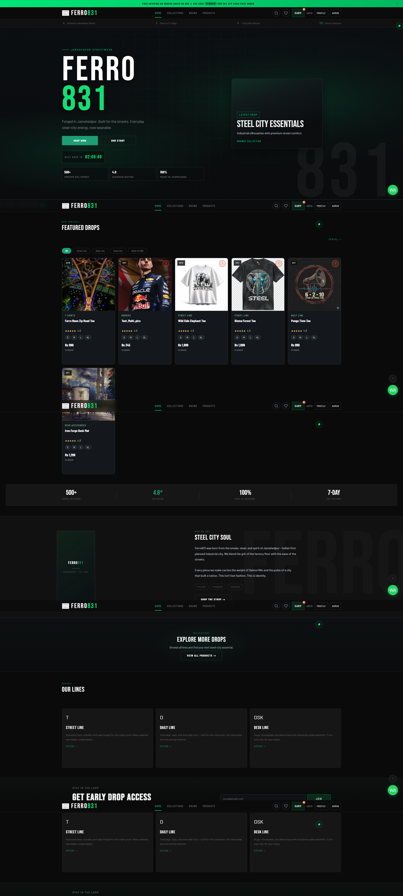
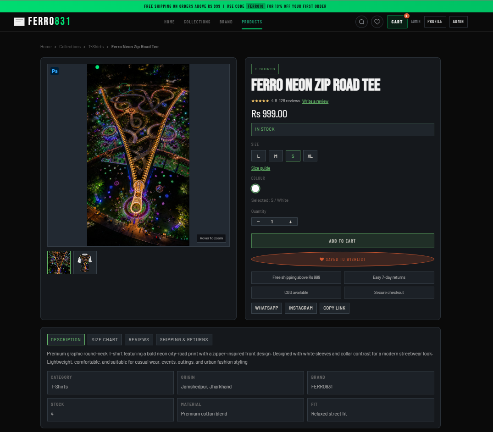
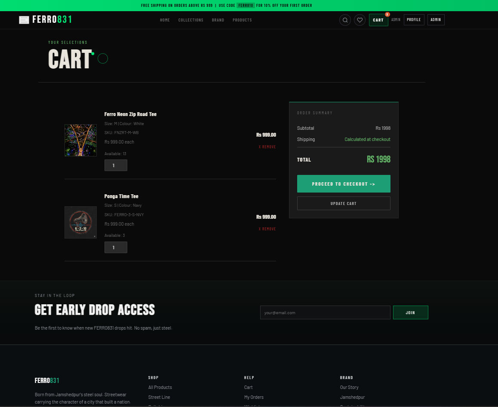
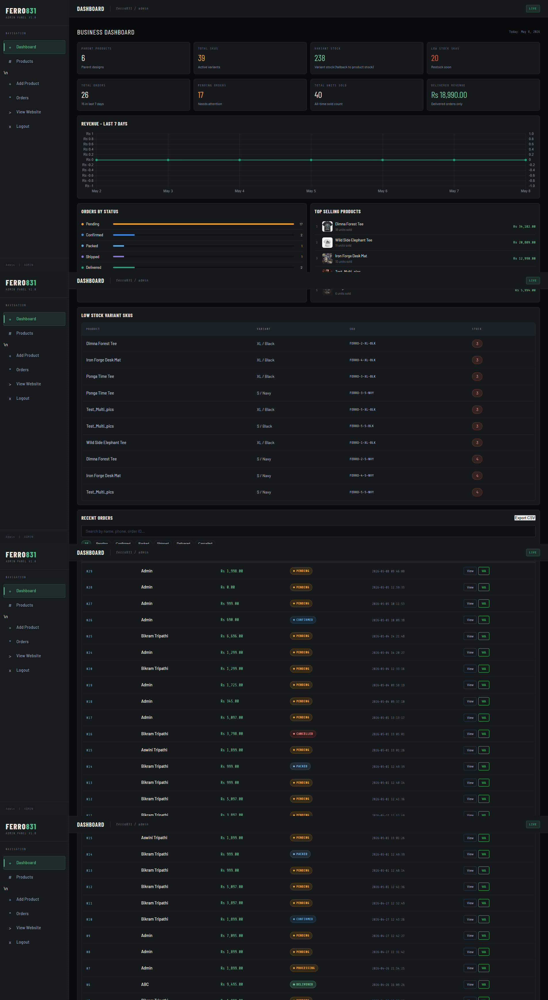
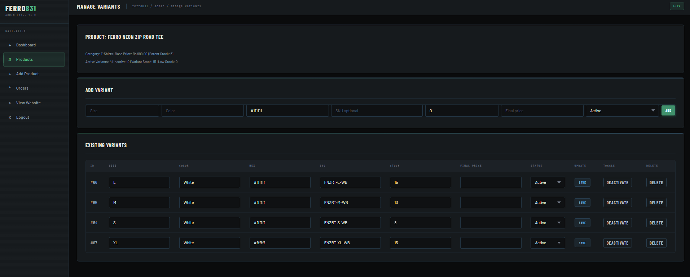

# FERRO831 E-Commerce Website

FERRO831 is a custom PHP + MySQL MVC-based e-commerce web application built for a Jamshedpur-inspired streetwear brand.  
The project was developed to understand real-world online store architecture, including product management, variants/SKUs, cart flow, checkout, user accounts, admin inventory control, and deployment preparation.

This is not a simple static website. It includes a working backend, database-driven products, session-based cart, variant-aware checkout, admin dashboard, inventory management, and a modern responsive UI.

---

## Project Purpose

The goal of this project is to build a practical e-commerce system from scratch using core web technologies.

Instead of depending on a full framework like Laravel, this project uses a custom MVC structure to understand how routing, controllers, models, views, sessions, authentication, database operations, and deployment work internally.

FERRO831 is designed around a fictional streetwear brand inspired by Jamshedpur's industrial and green identity.

---

## Key Features

### Customer Side

- Modern responsive homepage
- Product listing page
- Product search and filtering
- Product detail page
- Product image gallery
- Product variants/SKUs
- Size and color selection
- Variant-aware stock validation
- Session-based cart
- Cart drawer shell
- Wishlist system
- User registration and login
- User profile management
- Address management
- Guest checkout
- Logged-in checkout with saved addresses
- Order placement
- User order history
- Order detail and status timeline
- Mobile bottom navigation
- Search overlay
- Toast notifications
- Responsive UI for desktop and mobile

---

### Admin Side

- Admin login
- Admin dashboard
- Product management
- Product inventory overview
- Add product with multiple images
- Add product variants/SKUs
- Manage existing variants
- Activate/deactivate variants
- Variant stock management
- Variant price override support
- Product stock synchronization
- Order management
- Order detail view
- Order status update
- Tracking number update
- Order status history timeline

---

## Variant / SKU System

FERRO831 uses a parent-product and variant-based inventory structure.

### Product vs Variant Logic

```txt
products table
= parent product / design

product_variants table
= actual sellable SKU
```

Example:

```txt
Ponga Time Tee
├── S / Black / SKU: FERRO-3-S-BLK / Stock: 5
├── M / Black / SKU: FERRO-3-M-BLK / Stock: 8
├── L / Navy  / SKU: FERRO-3-L-NVY / Stock: 4
└── XL / Navy / SKU: FERRO-3-XL-NVY / Stock: 0
```

Important rules:

* Products with active variants cannot be added directly from product cards.
* Variant products show `SELECT OPTIONS`.
* Users must select size/color on the product detail page.
* Cart stores product and variant separately.
* Same product with different variants appears as separate cart lines.
* Checkout deducts variant stock.
* Parent product stock is synced with total active variant stock.
* `order_items` stores size, color, and SKU snapshots so old orders remain accurate even if variants change later.

---

## Cart and Checkout Flow

The cart is session-based.

```txt
User adds item
↓
Product ID + Variant ID stored in PHP session
↓
Cart model fetches latest product/variant data
↓
Checkout validates stock
↓
Order is created
↓
Order items are inserted
↓
Stock is deducted
↓
Order status history is created
```

Checkout supports:

* Guest checkout
* Logged-in checkout
* Saved address checkout
* Stock validation
* Variant stock deduction
* Product sold count update
* Order history generation

---

## Tech Stack

| Layer             | Technology               |
| ----------------- | ------------------------ |
| Backend           | PHP                      |
| Database          | MySQL / MariaDB          |
| Frontend          | HTML, CSS, JavaScript    |
| Architecture      | Custom MVC               |
| Local Server      | XAMPP                    |
| Deployment Target | Hostinger Shared Hosting |
| Version Control   | Git + GitHub             |

---

## Architecture Overview

The project follows a custom MVC architecture.

```txt
Browser Request
↓
Legacy Wrapper / Router
↓
Controller
↓
Model
↓
Database
↓
View
↓
Rendered HTML
```

### MVC Responsibilities

| Layer      | Responsibility                                 |
| ---------- | ---------------------------------------------- |
| Controller | Handles request flow and connects models/views |
| Model      | Handles database queries and business logic    |
| View       | Renders HTML/UI                                |
| Core       | Handles routing, base controller, base model   |
| Helpers    | URL, redirect, auth, escaping, flash messages  |

---

## Folder Structure

```txt
ferro831/
├── admin/                  # Admin legacy route wrappers
├── app/
│   ├── controllers/        # MVC controllers
│   ├── helpers/            # Helper functions
│   ├── models/             # Database/business logic
│   └── views/              # UI templates
├── assets/
│   ├── css/                # Customer/admin stylesheets
│   ├── js/                 # Frontend JavaScript
│   └── images/             # Product and site images
├── config/                 # Database configuration
├── core/                   # MVC core classes
├── docs/                   # Project documentation
├── includes/               # Legacy include compatibility
├── public/                 # Front controller
├── user/                   # User legacy route wrappers
├── index.php               # Homepage wrapper
├── products.php            # Products listing wrapper
├── product.php             # Product detail wrapper
├── cart.php                # Cart wrapper
├── checkout.php            # Checkout wrapper
└── README.md
```

---

## Main Routes

### Public Routes

| URL                  | Purpose                     |
| -------------------- | --------------------------- |
| `/index.php`         | Homepage                    |
| `/products.php`      | Product listing             |
| `/product.php?id=ID` | Product detail              |
| `/cart.php`          | Cart                        |
| `/checkout.php`      | Checkout                    |
| `/order-success.php` | Place order / order success |
| `/login.php`         | User login                  |
| `/register.php`      | User registration           |
| `/wishlist.php`      | User wishlist               |

---

### User Routes

| URL                          | Purpose            |
| ---------------------------- | ------------------ |
| `/profile.php`               | User profile       |
| `/addresses.php`             | Address book       |
| `/user/orders.php`           | User order history |
| `/user/view-order.php?id=ID` | User order detail  |

---

### Admin Routes

| URL                                        | Purpose                        |
| ------------------------------------------ | ------------------------------ |
| `/admin/login.php`                         | Admin login                    |
| `/admin/dashboard.php`                     | Admin dashboard                |
| `/admin/products.php`                      | Product inventory              |
| `/admin/add-product.php`                   | Add new product                |
| `/admin/manage-variants.php?product_id=ID` | Manage product variants        |
| `/admin/orders.php`                        | Order list                     |
| `/admin/view-order.php?id=ID`              | Order detail and status update |

---

## Database Tables

Main tables used in the project:

| Table                  | Purpose                             |
| ---------------------- | ----------------------------------- |
| `products`             | Parent product/design information   |
| `product_images`       | Product gallery images              |
| `product_variants`     | Sellable SKUs with size/color/stock |
| `users`                | User and admin accounts             |
| `user_addresses`       | Saved customer addresses            |
| `wishlist`             | User wishlist items                 |
| `orders`               | Order header/customer summary       |
| `order_items`          | Product snapshots inside each order |
| `order_status_history` | Order status timeline               |

---

## Important Database Rules

* `products.stock` should match the sum of active variant stock for products with variants.
* `product_variants.price_override` is optional.
* If `price_override` is empty or less than/equal to zero, product base price is used.
* `order_items` stores product name, price, size, color, and SKU at purchase time.
* Variants used in orders should not be hard-deleted; they should be deactivated to preserve order history.

---

## UI / UX Features

The customer-facing interface includes:

* Dark industrial streetwear theme
* Sticky glass-style navbar
* Search overlay
* Mobile bottom navigation
* Mobile drawer menu
* Toast notifications
* Cart drawer shell
* Product card hover actions
* Variant-safe product cards
* Responsive product grid
* Footer newsletter placeholder
* Mobile footer accordion
* Scroll reveal animations
* Modern homepage composition

---

## Local Setup

### Requirements

* XAMPP
* PHP 8.x recommended
* MySQL / MariaDB
* Web browser

---

### Installation Steps

1. Clone the repository:

```bash
git clone https://github.com/YOUR_USERNAME/ferro831.git
```

2. Move the project to XAMPP:

```txt
C:\xampp\htdocs\ferro831
```

3. Create a database in phpMyAdmin:

```txt
ferro831_db
```

4. Import the database schema manually.

5. Copy database config example:

```bash
copy config\db.example.php config\db.php
```

6. Update database credentials in:

```txt
config/db.php
```

Example for XAMPP:

```php
$host = "localhost";
$user = "root";
$password = "";
$database = "ferro831_db";
```

7. Start Apache and MySQL from XAMPP.

8. Open the project:

```txt
http://localhost/ferro831/
```

---

## Admin Access

Create an admin user manually in the database or through your local setup process.

Admin routes are available under:

```txt
http://localhost/ferro831/admin/login.php
```

For security reasons, real admin credentials are not included in this repository.

---

## Documentation

Detailed project documentation is available inside the `docs/` folder.

```txt
docs/
├── 01_PROJECT_OVERVIEW.md
├── 02_FOLDER_STRUCTURE.md
├── 03_ROUTES.md
├── 04_DATABASE.md
├── 05_FEATURES.md
├── 06_TESTING_CHECKLIST.md
├── 07_DEPLOYMENT_HOSTINGER.md
├── 08_BUG_LOG.md
└── 09_FUTURE_ROADMAP.md
```

These files document:

* Project overview
* Folder structure
* Routes
* Database design
* Features
* Testing checklist
* Hostinger deployment
* Bug tracking
* Future roadmap

---

## Testing Checklist

Before considering the project stable, test:

### Customer Flow

* Homepage loads
* Products page loads
* Product search works
* Product detail page loads
* Variant selection works
* Product can be added to cart
* Cart quantity update works
* Checkout works
* Order appears in user history
* Wishlist works
* Login/register works

### Admin Flow

* Admin login works
* Dashboard loads
* Products page loads
* Add product works
* Add variants works
* Manage variants works
* Variant stock sync works
* Orders page loads
* Order status update works

### Data Integrity

* Product stock matches active variant stock
* Order items store size/color/SKU
* Wishlist does not duplicate products
* Order status history updates correctly

---

## Deployment Notes

Deployment target: Hostinger Shared Hosting.

Before deploying:

* Update database credentials.
* Review `BASE_URL`.
* Review hardcoded `/ferro831/` paths.
* Check `mysqli_stmt_get_result()` compatibility.
* Confirm image upload folder permissions.
* Disable debug output.
* Do not upload SQL dumps publicly.
* Do not expose credentials.

See:

```txt
docs/07_DEPLOYMENT_HOSTINGER.md
```

---

## Security Notes

This project uses prepared statements for database operations, but additional hardening is recommended before real production use.

Recommended future security improvements:

* CSRF protection for forms
* Login rate limiting
* Stronger server-side validation
* Production error logging
* Secure upload validation
* HTTPS enforcement
* Admin activity logging

---

## Current Known Limitations

* Payment gateway is not integrated yet.
* Newsletter backend is currently a placeholder.
* Invoice PDF generation is planned but not implemented.
* Coupon system is planned.
* Some deployment settings require manual Hostinger configuration.
* Production hardening is still required before using this for a real store.

---

## Future Roadmap

Planned improvements:

* Reviews and ratings
* Coupon system
* Invoice PDF download
* Payment status tracking
* Shipping charge rules
* Admin bulk product update
* CSV import/export
* Product analytics
* Better search relevance
* CSRF protection
* Deployment hardening

---

## Screenshots

### Homepage


### Product Detail


### Cart


### Admin Dashboard


### Manage Variants


---

## GitHub Safety

The following are intentionally excluded from the repository:

* Real database credentials
* SQL dumps with real data
* Backup ZIP files
* Hostinger credentials
* Debug/test files
* Sensitive environment files

---

## Author

**Bikram Tripathi**

Computer Science & Engineering graduate building practical full-stack projects.

---

## License

This project is for learning, portfolio, and educational purposes.
